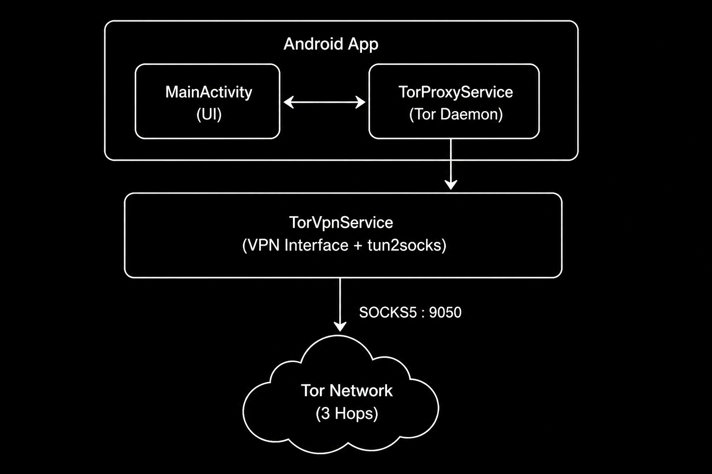

# TorDROID 🧅

> Android Tor VPN Client written in Java

Route Android traffic through the Tor Network using a transparent VPN tunnel powered by Android's native VPN API.

---

## Overview

TorDROID is an Android application that routes device traffic through the Tor Network using Android's VPN API.

The application launches a local Tor daemon, establishes a VPN tunnel, and transparently forwards all traffic through a local Tor SOCKS5 proxy.

### Highlights

- Full-device VPN routing through Tor
- Real-time bootstrap monitoring
- Exit-node IP detection
- One-tap New Identity request
- Foreground service support
- Optional auto-start on boot
- No root access required
- Material Design interface

---

## Features

| Feature                | Status |
| ---------------------- | ------ |
| Tor Daemon Integration | ✅     |
| Android VPN Support    | ✅     |
| SOCKS5 Routing         | ✅     |
| Bootstrap Monitoring   | ✅     |
| Exit Node Detection    | ✅     |
| New Identity Support   | ✅     |
| Foreground Service     | ✅     |
| Boot Auto Start        | ✅     |
| Dark Theme UI          | ✅     |
| Bridge Support         | 🚧     |
| Snowflake Support      | 🚧     |
| Onion Services         | 🚧     |

---

## Architecture

---

## License

Licensed under the GNU Affero General Public License v3.0 (AGPL-3.0).
